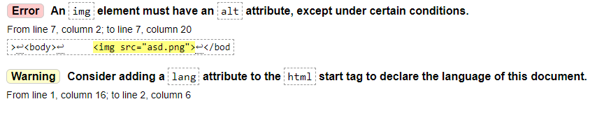
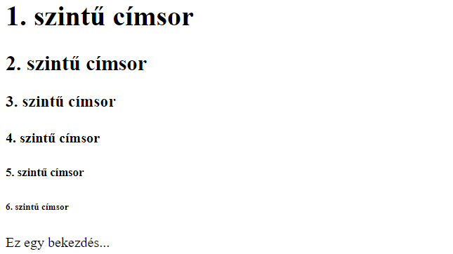
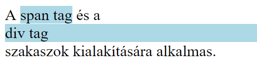

# 1. gyakorlat


## A gyakorlat anyaga

A [követelmények](../kovetelmenyek) ismertetése.

Ezen a gyakorlaton röviden áttekintjük a kurzuson tárgyalt három nyelv (HTML, CSS és PHP) általános szerepét a webfejlesztésben. Ezt követően megismerkedünk a HTML nyelv néhány alapvető elemével.


### Áttekintés

A félév során a HTML, CSS és PHP nyelvekkel fogunk megismerkedni. Az alábbi táblázatban röviden összefoglaljuk ezeknek a nyelveknek az általános szerepét a webfejlesztésben.

|              |                             HTML                             |                CSS               |                                                   PHP                                                   |
|:------------:|:------------------------------------------------------------:|:--------------------------------:|:-------------------------------------------------------------------------------------------------------:|
| **Micsoda?** |                          jelölőnyelv                         |         stílusleíró nyelv        |                                        szerveroldali szkriptnyelv                                       |
|  **Szerepe** | weboldalak tartalmának kialakítása, a tartalom strukturálása | weboldalak tartalmának formázása | tartalom dinamikus generálása, űrlapfeldolgozás, adatbázis-kezelés, menetkövetés, fájlkezelés, OOP, ... |


### HTML alapok (1. rész)


#### Bevezetés

A **HTML** (HyperText Markup Language) egy leíró nyelv, aminek segítségével megmondhatjuk, hogy mi az, amit egy weboldalon látni szeretnénk (pl. szövegek, képek, hivatkozások, táblázatok, multimédia elemek).

A weboldal tartalmát lehetőségünk van strukturálni is HTML-ben, különböző szakaszok, tartalmi egységek kialakításával (pl. fejléc, menüsor, fő tartalom, lábléc).

A HTML kód írása roppant egyszerű:

* A kódot tetszőleges szerkesztőprogramba írjuk (pl. Gedit, Notepad++, WebStorm stb.)
* Az állományt `.html` kiterjesztéssel mentjük el
* Végül a fájlt megnyitjuk egy szimpatikus böngészővel, és már láthatjuk is az eredményt.

!!! note "Megjegyzés"
    A HTML kódot más-más böngészők (illetve böngészőverziók) eltérő módon jeleníthetik meg.


#### Szabványok

A weboldalak készítésére vonatkozóan a **W3C** (World Wide Web Consortium) ad ki előírásokat, szabványokat.

Fontosabb HTML szabványok:

* **HTML 4.01** (1999)

* **XHTML 1.0 Strict** (2000)
    * a korábbi HTML 4 szabvány "újraírása" XML alapokon
    * szigorú szabályok jellemzik
    * HTML dokumentumok egységessé tétele, egyszerűbb feldolgozás programmal

* **HTML5** (2014)
    * kevésbé szigorú az XHTML 1.0 Strict-hez képest
    * programmal valamelyest nehezebb feldolgozni
    * számos újdonságot tartalmaz elődjeihez képest (pl. szemantikus elemek, multimédia, grafikus elemek, új űrlapmező típusok).

A gyakorlaton a **HTML5** és **CSS3** szabványokkal fogunk foglalkozni. A webfejlesztés során érdemes törekednünk a választott szabvány előírásainak betartására!


##### Szabványosság ellenőrzése

A weboldalunk szabványosságát legegyszerűbben böngésző plug-inek vagy az alábbi online validator szoftverek segítségével ellenőrizhetjük:

* [HTML validator](https://validator.w3.org/)
* [CSS validator](https://jigsaw.w3.org/css-validator/).

!!! hint "Tipp"
    A beadandó projekt szabványosságát a fenti eszközökkel egyszerűen ellenőrizhetitek.

Az érvényesíteni kívánt fájl feltöltése után, amennyiben nem szabványos az általunk írt kód, a validator különböző megjegyzéseket bocsát a rendelkezésünkre:

* A piros hátterű `Error`-ok komolyabb validálási hibákat jelentenek, amiket mindenképpen javítanunk kell. A hibaüzenetből egy kis angol tudással egyszerűen rájöhetünk a problémára (ha esetleg nem jöttök rá, nyugodtan kérdezzétek a gyakorlatvezetőtöket). 
* A sárga hátterű `Warning`-ok kevésbé súlyos figyelmeztetések, amelyek általában megfontolandóak. Ezeknek a maradéktalan kijavítása viszont nem elvárt ezen a kurzuson.

<span class="example">Példa:</span> Egy validator által jelzett validálási hiba és figyelmeztetés




#### Alapfogalmak


##### Tagek

A HTML fájlok alapvető elemei a **tagek**. Ezek `<` és `>` közé írt, speciális jelentéssel bíró HTML objektumok. A HTML nyelv egy előre definiált tagkészlettel rendelkezik.

A legtöbb HTML tag **páros tag**, ami azt jelenti, hogy egy nyitótagből és egy zárótagből áll. A zárótaget úgy képezzük a nyitótagből, hogy a tag neve elé, azaz közvetlenül a `<` után egy perjelet teszünk.

```html
<p>Ide jön valami szöveg</p>
```

Vannak viszont **páratlan tagek** (másnéven **üres tagek**) is, amelyek csak nyitótagből állnak. Ilyen például a sortörés beszúrására alkalmas `<br>` tag.

```html
Első sor <br>Második sor
```

A páratlan tagek végére opcionálisan egy perjelet is tehetünk (tehát például `<br>` helyett azt is írhatjuk, hogy `<br/>`). Ebben a jegyzetben minden páratlan tag esetén kitesszük ezt a perjelet, noha ez HTML5-ben elhagyható.

A HTML tageket egymásba ágyazhatjuk. Ekkor fontos, hogy az egymásba ágyazott tageket belülről kifelé haladva kell lezárnunk.

<span class="example">Példa:</span> Tagek egymásba ágyazása - először lezárjuk a legbelső `<a>` taget, majd az őt beágyazó `<p>` taget, végül pedig a legkülső `<div>` taget

```html
<div><p><a href="https://www.pointless.com/">Ide jön valami szöveg...</a></p></div>
```


##### Attribútumok

A tagekhez tartozhatnak bizonyos speciális tulajdonságok, úgynevezett **attribútumok**, amelyekhez speciális értékeket rendelhetünk.

A tagekhez tartozó attribútum-érték párokat a nyitótag neve után írjuk, szóközzel elválasztva.

<span class="example">Példa:</span> Egy páros `<a>` tag, amely a `href` és `target` attribútumokkal rendelkezik

```html
<a href="https://www.google.com" target="_blank">Google</a>
```

<span class="example">Példa:</span> Egy páratlan `` tag, amely az `src`, `alt` és `width` attribútumokkal rendelkezik

```html

```


#### A HTML dokumentum felépítése

Minden HTML dokumentumunk megírása az alábbi kóddal kezdődik:

```html
<!DOCTYPE html>
<html lang="hu">
  <head>
    <title>Weboldal címe...</title>
    <meta charset="UTF-8"/>
  </head>
  <body>

  </body>
</html>
```

!!! hint "Tipp"
    A fenti (vagy ahhoz hasonló) alap HTML kódot néhány szerkesztőprogrammal le is generáltathatjuk:
    <ul>
        <li>A WebStorm automatikusan generálja a kódot HTML fájlok esetén</li>
        <li>Sublime Text Editorban legépeljük, hogy `html`, majd közvetlen utána nyomunk egy <kbd>Tab</kbd>-ot</li>
        <li>Visual Studio Code-ban leírunk egy felkiáltójelet (`!`), majd közvetlen utána nyomunk egy <kbd>Tab</kbd>-ot</li>
    </ul>

Nézzük meg, hogy mi mit is jelent a kódban!

* `<!DOCTYPE html>`: megmondjuk, hogy a HTML5 szabvány szerint írtuk a kódot
* `<html>...</html>`: ez írja le magát a weboldalt
    * a `lang` attribútummal megadhatjuk a weboldal tartalmának nyelvét
* `<head>...</head>`: **fejrész** - az oldalon nem megjelenő tartalom (metainformációk), fájlcsatolások, CSS- és szkriptbeágyazások helye
    * `<title>...</title>`: a böngészőfülön megjelenő cím
    * `<meta charset="UTF-8"/>`: UTF-8 karakterkódolás beállítása
* `<body>...</body>`: **törzsrész** - a megjelenő tartalom, strukturális elemek és szkriptek helye


#### Kommentek

A HTML fájlokba lehetőségünk van kommenteket (megjegyzéseket) írni az alábbi szintaxissal:

```html
<!-- Ez egy komment a HTML kódban -->
```

A kommentek szövege a weboldalon természetesen nem jelenik meg, viszont a HTML forráskódban (amit a <kbd>Ctrl</kbd>+<kbd>Shift</kbd>+<kbd>I</kbd> billentyűkombinációval egyszerűen megtekinthetünk) láthatóak lesznek az általunk írt kommentek. 


#### A head fontosabb tagjei

Az alábbiakban felsoroljuk a HTML dokumentum fejrészében (`<head>` és `</head>`) között használatos fontosabb tageket.

* `<title>...</title>`: a böngészőfülön megjelenő cím (ezt mindig adjuk meg!)
* `<meta charset="UTF-8"/>`: UTF-8 karakterkódolás beállítása (ezt mindig adjuk meg!)
* `<meta name="author" content="Gipsz Jakab"/>`: a weboldal szerzője
* `<meta name="description" content="Jakab blogoldala"/>`: a weboldal leírása
* `<meta name="keywords" content="webtervezés,webterv,HTML,CSS,PHP"/>`: kulcsszavak megadása (célja a találati esélyeink javítása)
* `<link rel="stylesheet" href="valami.css"/>`: külső CSS fájl beágyazása
* `<style>...</style>`: CSS formázás beszúrása
* `<script>...</script>`: szkript (pl. JavaScript) beszúrása


#### A body fontosabb tagjei

Az alábbiakban megismerkedünk a HTML dokumentum törzsrészében (`<body>` és `</body>` között) használható néhány fontosabb taggel.


##### Bekezdések, címsorok

* `<p>...</p>`: bekezdés
* `<h1>...</h1>`: 1. szintű címsor (legfontosabb)
* `<h2>...</h2>`: 2. szintű címsor
* `<h3>...</h3>`: 3. szintű címsor
* `<h4>...</h4>`: 4. szintű címsor
* `<h5>...</h5>`: 5. szintű címsor
* `<h6>...</h6>`: 6. szintű címsor (legkevésbé fontos)

```html
<!DOCTYPE html>
<html lang="hu">
  <head>
    <title>Bekezdések, címsorok</title>
    <meta charset="UTF-8"/>
  </head>
  <body>
    <h1>1. szintű címsor</h1>
    <h2>2. szintű címsor</h2>
    <h3>3. szintű címsor</h3>
    <h4>4. szintű címsor</h4>
    <h5>5. szintű címsor</h5>
    <h6>6. szintű címsor</h6>
    <p>Ez egy bekezdés...</p>
  </body>
</html>
```

A fenti HTML kódot tartalmazó fájlt böngészőben megnyitva a következőt kapjuk:




##### Karakterentitások

Mivel a HTML-ben vannak speciális célt szolgáló  karakterek (pl. a `<` és a `>` karakterek), ezért ezeket valahogy máshogy kell írnunk, ha meg szeretnénk őket jeleníteni a weboldalunkon. Az ilyen karakterek tárolására használjuk a **karakterentitások**at.

Néhány gyakran használt karakterentitás (teljes lista [itt](https://dev.w3.org/html5/html-author/charref)):

| Karakterentitás | Megjelenítés |   Elnevezés  |
|:---------------:|:------------:|:------------:|
|     `nbsp;`     |              |    szóköz    |
|      `&lt;`     |       <      |  kisebb mint |
|      `&gt;`     |       >      | nagyobb mint |
|     `&amp;`     |       &      |    és-jel    |
|     `apos;`     |       '      |   aposztróf  |
|     `&quot;`    |       "      |   idézőjel   |
|     `&copy;`    |       ©      |   copyright  |


<span class="example">Példa:</span> Ha egy bekezdésbe azt szeretnénk írni, hogy `5 < 10 > 8`, akkor azt a következőképpen tehetjük meg karakterentitások használatával

```html
<p>5 &lt; 10 &gt; 8</p>
```


##### Képek

Ha a weboldalunkra egy képet szeretnénk beszúrni, akkor ezt az `` nevű páratlan taggel tudjuk megtenni. A tag fontosabb attribútumai:

* `src`: a kép elérési útvonala (kötelező megadni)
* `alt`: helyettesítő szöveg, ha a kép nem jelenik meg (kötelező megadni)
* `title`: a kép címe, ami akkor jelenik meg, ha a kurzor a kép fölött áll
* `width`: a kép szélessége (pixelben)
* `height`: a kép magassága (pixelben).

Ha a `width` és `height` attribútumok közül csak az egyiket adjuk meg, akkor a másik a kép eredeti méretarányaiból számolódik. Tehát például ha egy 400x300-as (400 pixel széles, 300 pixel magas) kép szélességét 800 pixelre állítjuk (megduplázzuk), akkor a magassága automatikusan 600 pixel lesz.

<span class="example">Példa:</span> A HTML fájllal egy mappában van egy `img` mappa, amiben található a `cat.jpg` kép. Szúrjuk be a képet a weboldalunkra úgy, hogy a szélessége 400 pixel legyen!

```html
<!DOCTYPE html>
<html lang="hu">
  <head>
    <title>Kép beszúrása</title>
    <meta charset="UTF-8"/>
  </head>
  <body>
    
  </body>
</html>
```


##### Az id és class attribútumok

Minden HTML objektumnak adható egyedi azonosító, illetve minden HTML objektum csoportosítható osztályokba. Ezek CSS-ben lesznek majd hasznosak, amikor egy-egy objektumra vagy objektumok csoportjára szeretnénk hivatkozni.

Az **egyedi azonosító** (`id`) értéke a dokumentumon belül egyedi kell, hogy legyen. Emellett az attribútum értéke nem tartalmazhat szóközt.

Az **osztály** (`class`) értéke nem kell, hogy egyedi legyen (sőt általában nem az). Értékéül szóközzel elválasztva megadható több osztály neve is, amihez az adott elem tartozik.

<span class="example">Példa:</span> `id` és `class` attribútumok használata

```html
<!DOCTYPE html>
<html lang="hu">
  <head>
    <title>id, class</title>
    <meta charset="UTF-8"/>
  </head>
  <body>
    <!-- Egy "asd" egyedi azonosítóval rendelkező bekezdés, ami a "foo" osztályhoz tartozik -->
    <p id="asd" class="foo">Ide jön valami szöveg...</p>

    <!-- Egy kép, ami a "foo" és "bar" osztályokhoz tartozik -->
     
  </body>
</html>
```


##### Hivatkozások (Linkek)

Hivatkozásokat (avagy linkeket) az `<a>...</a>` páros tag segítségével szúrhatunk be a weboldalunkra. A tag fontosabb attribútumai:

* `href`: cél, ahova a hivatkozásra kattintva jutunk
    * lehet egy másik weboldal - pl. `<a href="https://www.google.com">Google</a>`
    * lehet egy másik fájl - pl. `<a href="bevasarlolista.txt">Bevásárlólista</a>`
    * lehet lapon belüli hivatkozás - pl. `<a href="#top">Vissza a tetejére</a>` (ez az `id="top"` attribútummal rendelkező elemre mutat)
* `target`: hol legyen megnyitva a hivatkozott cél
    * `_self`: ugyanott, ahol rákattintottunk (alapértelmezett)
    * `_blank`: új lapon vagy ablakban
* `title`: hivatkozás címe, ami akkor jelenik meg, ha a kurzor a hivatkozás fölött áll.

<span class="example">Példa:</span> Hivatkozások beszúrása

```html
<!DOCTYPE html>
<html lang="hu">
  <head>
    <title>Hivatkozások</title>
    <meta charset="UTF-8"/>
  </head>
  <body>
    <h1 id="top-of-page">Hivatkozások (linkek)</h1>

    <!-- Egy hivatkozás, ami egy másik weboldalt nyit meg egy új lapon -->
    <p><a href="https://youtu.be/dQw4w9WgXcQ" target="_blank">Valami klassz dolog</a></p>

    <!-- Egy hivatkozás, ami egy képet nyit meg ugyanott, ahol a linkre kattintottunk -->
    <a href="img/cat.jpg" title="Megtekintés nagyobb méretben">
      
    </a>

    <!-- Egy hivatkozás, ami az id="top-of-page" attribútummal rendelkező elemre mutat -->
    <p><a href="#top-of-page">Vissza a lap tetejére</a></p>
  </body>
</html>
```


##### Szakaszok

HTML-ben lehetőségünk van a weboldal tartalmának strukturálására is. Ezt szakaszok, tartalmi egységek kialakításával tehetjük meg.

A `<div>...</div>` általános célú **blokkszintű (block)** szakasz. A blokkszintű elemek mindig új sorban kezdődnek, és kihasználják a rendelkezésre álló szélességet.

A `<span>...</span>` átalános célú **sorszintű (inline)** szakasz. A sorszintű elemek nem kezdődnek új sorban, illetve szélességük csak akkora, mint amekkora helyre szükségük van.

<span class="example">Példa:</span> A `<span>` és `<div>` tagek használata

```html
<!DOCTYPE html>
<html lang="hu">
  <head>
    <title>Szakaszok</title>
    <meta charset="UTF-8"/>
  </head>
  <body>
    A <span>span tag</span> és a <div>div tag</div> szakaszok kialakítására alkalmas.
  </body>
</html>
```




## Gyakorló feladat

Készíts egy egyszerű weboldalt, amin bemutatod saját magadat (vagy a kedvenc filmedet, a hobbidat stb.)! Az oldal tartalmazza az alábbi elemeket:

* címsorok
* bekezdések
* képek
* hivatkozások
* tartalmi egységek (szakaszok)!

