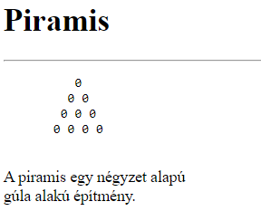
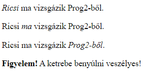
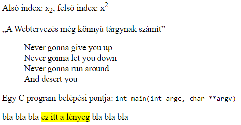

# 2. gyakorlat

## A gyakorlat anyaga

Ezen a gyakorlaton folytatjuk a HTML tagekkel és azok attribútumaival való ismerkedést. Ezt követően szó lesz a CSS-ről és annak alapvető elemeiről.


### A HTML alapjai (2. rész)

Az alábbiakban folytatjuk a HTML dokumentum törzsrészében (`body`) használatos tagekkel való ismerkedést.


#### Néhány fontosabb szövegelem

* `<h1>...</h1>`, `<h2>...</h2>`, ..., `<h6>...</h6>`: címsorok
* `<p>...</p>`: bekezdés
* `<br/>`: sortörés (páratlan tag)
* `<hr/>`: elválasztó vonal (páratlan tag)
* `<pre>...</pre>`: előre formázott szöveg
    * alakhű megjelenítést biztosít: a szöveg megőrzi a whitespace karaktereket (pl. szóköz, sortörés, tabulátor)
    * akkor használjuk, ha a szöveg jellegéből szemantikusan következik a tartalom szóközökkel, térközökkel való formázása (pl. ASCII-ábrák, kódrészletek, képversek)

```html
<!DOCTYPE html>
<html lang="hu">
  <head>
    <title>Fontosabb szövegelemek</title>
    <meta charset="UTF-8"/>
  </head>
  <body>
    <h1>Piramis</h1>
    <hr/>
    <pre>
          0
         0 0
        0 0 0
       0 0 0 0
    </pre>
    <p>A piramis egy négyzet alapú <br/> gúla alakú építmény.</p>
  </body>
</html>
```




* `<em>...</em>`: tartalom hangsúlyozása (szemantikus jelentés, általában dőlt betűkkel jelenik meg)
* `<strong>...</strong>`: erős kiemelés (szemantikus jelentés, általában félkővér betűkkel jelenik meg)

```html
<!DOCTYPE html>
<html lang="hu">
  <head>
    <title>Fontosabb szövegelemek</title>
    <meta charset="UTF-8"/>
  </head>
  <body>
    <p><em>Ricsi</em> ma vizsgázik Prog2-ből.</p>   <!-- Ki vizsgázik? -->
    <p>Ricsi <em>ma</em> vizsgázik Prog2-ből.</p>   <!-- Mikor vizsgázik? -->
    <p>Ricsi ma vizsgázik <em>Prog2-ből</em>.</p>   <!-- KMiből vizsgázik? -->

    <p><strong>Figyelem!</strong> A ketrebe benyúlni veszélyes!</p>
  </body>
</html>
```



!!! note "Megjegyzés"
    A HTML tageket ne formázási célokra használjuk! Ha egy szövegrészt félkövérré vagy dőltté szeretnénk tenni, használjunk CSS-t!

* `<sub>...</sub>`: alsó index
* `<sup>...</sup>`: felső index
* `<q>...</q>`: idézet (az idézőjeleket automatikusan kiteszi)
* `<blockquote>...</blockquote>`: idézetblokk
* `<code>...</code>`: kódrészlet
* `<mark>...</mark>`: vizuális szövegkiemelés

```html
<!DOCTYPE html>
<html lang="hu">
  <head>
    <title>Fontosabb szövegelemek</title>
    <meta charset="UTF-8"/>
  </head>
  <body>
    <p>Alsó index: x<sub>2</sub>, felső index: x<sup>2</sup></p>
    <p><q>A Webtervezés még könnyű tárgynak számít</q></p>

    <blockquote>
      Never gonna give you up <br/>
      Never gonna let you down <br/>
      Never gonna run around <br/>
      And desert you
    </blockquote>

    <p>Egy C program belépési pontja: <code>int main(int argc, char **argv)</code></p>
    <p>bla bla bla <mark>ez itt a lényeg</mark> bla bla bla</p>
  </body>
</html>
```




#### Iframe

Az `<iframe>...</iframe>` tag segítségével beszúrhatunk egy úgynevezett iframe-et (inline frame, másnéven lebegőkeret) a weboldalunkra. Ezekben az iframe-ekben lehetőségünk van megnyitni egy másik weboldalt.

A tag fontosabb attribútumai:

* `src`: a megnyitni kívánt weboldal URL-je
* `width`: az iframe szélessége (pixelben)
* `height`: az iframe magassága (pixelben).

<span class="example">Példa:</span> Szúrjuk be a TTIK honlapját a weboldalunkra egy 600x600-as iframe-ben!

```html
<!DOCTYPE html>
<html lang="hu">
  <head>
    <title>Iframe példa</title>
    <meta charset="UTF-8"/>
  </head>
  <body>
    <iframe src="http://ttik.hu" width="600" height="600"></iframe>
  </body>
</html>
```


#### Listák

TODO


#### Táblázatok

TODO
